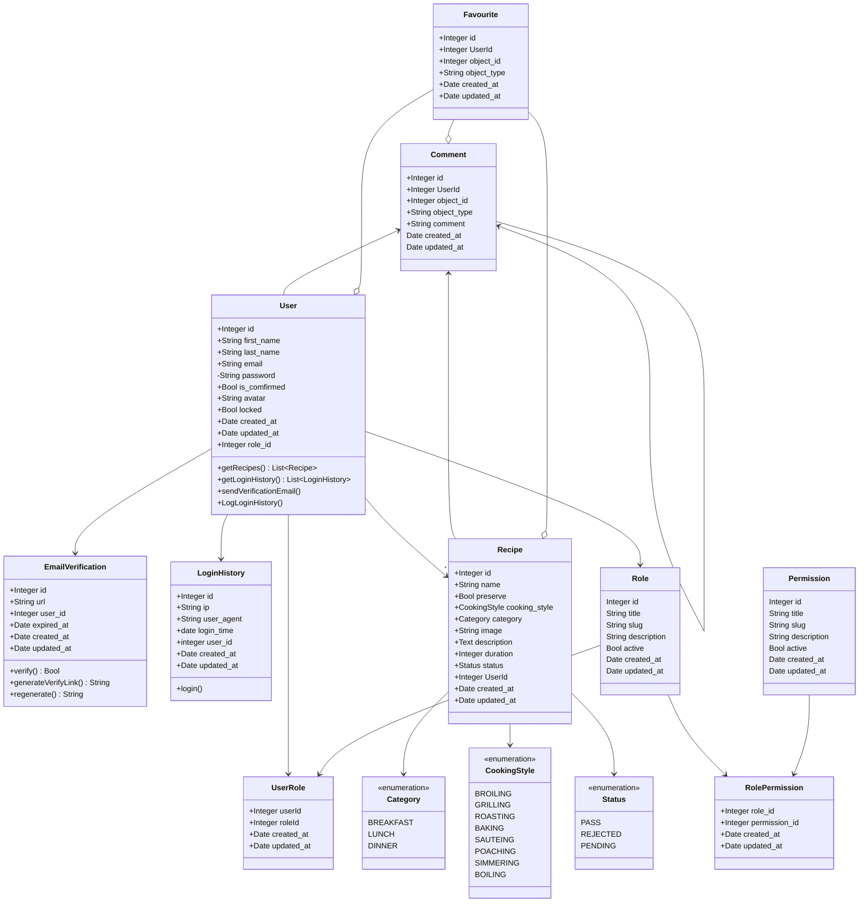

1. Install dependencies

```bash
npm i -D nodemon
npm i koa koa-router koa-body koa-bodyparser koa-views koa-static mysql2 sequelize ejs koa-override
```

2. Design user and recipe model



3. Create a database and assign a new user to it.

```bash
create database nodejs_recipe_template default charset=utf8mb4;
create user 'recipe'@'localhost' identified by 'secret';
grant all privileges on nodejs_recipe_template.* to 'recipe'@'localhost';
flush privileges;
```

4. Initiate sequelize file and generate model files

> [Sequelize DataTypes](https://sequelize.org/master/variable/index.html#static-variable-DataTypes)

```bash
npx sequelize init
npx sequelize model:generate --name Role --attributes title:string,slug:string,description:string,active:boolean
npx sequelize model:generate --name Permission --attributes title:string,slug:string,description:string,active:boolean
npx sequelize migration:generate --name role_and_permission_association
npx sequelize model:generate --name User --attributes first_name:string,last_name:string,email:string,password:string,is_comfirmed:boolean
npx sequelize migration:generate --name user_and_role_association
npx sequelize model:generate --name EmailVerification  --attributes url:string,expired_at:date,UserId:integer
npx sequelize migration:generate --name user_and_role_association
npx sequelize migration:generate --name add_avatar_to_user
npx sequelize model:generate --name Recipe --attributes name:string,preserve:boolean,cooking_style:string,category:string,image:string,description:text,duration:integer,status:string,UserId:integer
npx sequelize model:generate --name Comment --attributes UserId:integer,object_id:integer,object_type:string,comment:string
npx sequelize model:generate --name Favourite --attributes UserId:integer,object_id:integer,object_type:string
npx sequelize seed:generate --name create_random_recipe
npx sequelize seed:generate --name generate-user
npx sequelize db:seed --seed 20211019075939-generate-user
```

https://medium.com/@andrewoons/how-to-define-sequelize-associations-using-migrations-de4333bf75a7

Sequelize associate multiple tables to 1 table with 2 foreign keys

### Make a fold for uploaded images

```
mkdir static/uploads
```

### Enviration

```
.env

PORT=8001

MAIL_MAILER=smtp
MAIL_HOST=smtp.mailtrap.io
MAIL_PORT=2525
MAIL_USERNAME=
MAIL_PASSWORD=
MAIL_ENCRYPTION=tls
MAIL_FROM_ADDRESS=
```
